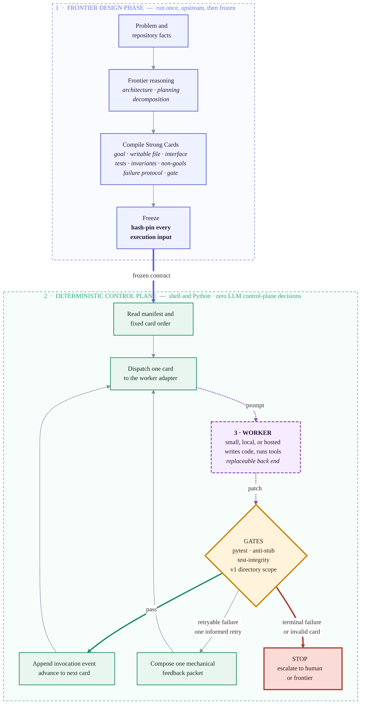

# Strong Cards

```text
  _____ _____ ____   ___  _   _  ____    ____    _    ____  ____  ____
 / ___//_   _/|  _ \ / _ \| \ | |/ ___|  / ___|  / \  |  _ \|  _ \/ ___|
 \___ \  | |  | |_) | | | |  \| | |  _  | |     / _ \ | |_) | | | \___ \
  ___) | | |  |  _ <| |_| | |\  | |_| | | |___ / ___ \|  _ <| |_| |___) |
 /____/  |_|  |_| \_\\___/|_| \_|\____|  \____/_/   \_\_| \_\____/|____/
```

## Bringing LLM work under deterministic control — and making hub-and-spoke orchestration stronger and cheaper

A **Strong Card** is a frozen, hash-pinned execution contract, compiled once by
a frontier model before any worker runs.

| Contract element | What it fixes |
|---|---|
| One goal | The transformation the worker must perform |
| One writable file | The worker's implementation authority |
| Interface stub | The required shape of the solution |
| Executable examples and property tests | Acceptance evidence, decided by machine |
| Invariants and forbidden shortcuts | Properties that must remain true |
| Non-goals | Work that must not be attempted |
| Failure protocol | When retrying or stopping is valid behavior |
| Machine gate | The exact rule for acceptance, with a completion record |

A Strong Card is not a longer prompt. It is the compiled intermediate
representation between reasoning and execution: the frontier model spends its
reasoning budget once, while ambiguity can still be removed, and the worker is
never asked to rediscover the architecture on every card. See the
[formal definition](docs/strong-card-concept.md).

This pilot advances two connected goals:

| Goal | Role of Strong Cards |
|---|---|
| LLM work under fully deterministic control | Move runtime authority from an LLM orchestrator into explicit, replayable code |
| Stronger, cheaper hub-and-spoke orchestration | Give worker spokes frozen contracts and machine gates instead of open-ended prompts, so the hub's reasoning is reserved for genuine exceptions |

The pilot directly evaluates the first architecture. Applying Strong Cards
inside LLM-orchestrated systems is a forward engineering direction, not a
result proved here.

In this pilot, local Gemma 4 31B made the published gates green through Card 9
of the ten-card ladder on first attempts. Local Qwen3.6 27B reached the same
published-gate ceiling after an extended retry. Eight of thirteen hosted configurations reached it
through OpenCode CLI routes. The point is not that smaller models imitate a
frontier model. It is that they can do substantial implementation work once
frontier reasoning is moved upstream and runtime authority is moved into
deterministic code.

This repository contains the historical control scripts, frozen card artifacts,
derived result ledgers, two accepted Card 9 outputs, audits that found defects
in Cards 9 and 10, and the next protocol. It is a first pilot, not a universal
benchmark or a replay-complete release.

## The research question

Most model comparisons ask every model to solve the same open-ended prompt.
That mixes architecture, planning, implementation, tool use, taste, and
verification into one opaque score.

This experiment asked a different question:

> If a frontier model first compresses a problem into bounded, executable
> contracts, how much complex work can smaller and local models perform when a
> plain program, rather than another LLM, controls the run?

GPT-5.5 at medium reasoning effort, through Codex, authored the ten-card deck.
The manifest incorrectly labels authoring effort as high; session metadata and
the contemporary handoff recover the exact attribution. Deck development was
adaptive, and later cards incorporated prior failure evidence. All ten artifacts
were then hash-frozen before the principal comparison sweeps. The authoring
model left the runtime control plane.

At runtime, shell and Python code owned card order, dispatch, pytest, anti-stub
checks, one informed retry, stop conditions, and per-invocation evidence
capture. The worker LLM still chose code and tool actions; it made zero routing,
retry, acceptance, or stop decisions. The historical scripts are public,
including their incomplete v1 scope gate and directory-based—not OS-level—isolation.

## Execution surfaces

| Lane | Agent harness | Surface | Inference backend | Model builds |
|---|---|---|---|---|
| Local | Claude Code, headless | `claude-ollama` | Ollama on the test machine | MTP builds, quant in the tag (`bf16`, `q8_0`) |
| Hosted | OpenCode CLI | OpenCode Go routes | Provider-managed | Quantization undisclosed by providers; not guessed here |
| Frontier reference | Codex | Codex CLI | Provider-managed | GPT-5.5 at xhigh effort, Card 10 only |

Other local surfaces were tried before the pilot, including Aider and the
OpenCode CLI over the same Ollama backend. Tool calling through the
OpenCode-plus-Ollama combination was not reliable at pilot time, so it was set
aside for later work. For now, the Claude Code headless harness was the most
effective local surface tried: it converted worker intent into file writes and
tool calls reliably enough to carry every published local result. That is an
operational observation, not a controlled harness benchmark; no such benchmark
was run.

The distinction matters because harness quality is part of measured capability:
earlier direct local routes produced no-write artifacts that disappeared under a
functional tool loop. An agent benchmark measures model, prompt, tool schema,
adapter, permissions, time budget, and gate together.

## The ten cards

The deck is a progressive ladder, not ten unrelated prompts. Each card adds a
different kind of engineering pressure while keeping the worker inside a frozen
contract. C5 and C6 deliberately revisit C1 and C2 under harder conditions.

| Card | Task | The challenge | Public tests |
|---|---|---|---:|
| C1 | LRU cache | Fixed capacity, recency refreshed on every hit and update, evict exactly the least-recently-used key when full | 7 |
| C2 | Interval merge | Closed integer intervals, so touching ranges merge; canonical sorted output; caller input never mutated | 7 |
| C3 | Bank ledger | Not CRUD but a state machine: rejected debits leave state untouched, transfers are atomic, no balance crosses the overdraft limit | 6 |
| C4 | Undo stack | Immutable undo and redo, where a push after an undo must branch and discard the redo future | 5 |
| C5 | Generic LRU class | C1's behavior again as a typed, reusable generic class | 9 |
| C6 | Rich interval merge | C2 under pressure: negative, nested, duplicate, zero-length, unsorted, densely overlapping ranges | 12 |
| C7 | Expression evaluator | Hand-written parser for integer arithmetic with variables, precedence, unary signs and parentheses; no `eval` | 8 |
| C8 | Topological batcher | Batch tasks into parallel waves by dependency order, detect cycles, sort each batch for deterministic output | 9 |
| C9 | Spreadsheet engine | Everything above at once: formula parser, forward references, `SUM(A1:B3)` ranges, cycle detection, truncating division | 11 |
| C10 | Glob matcher | The intended grandmaster rung — but **unsatisfiable as written**: a fixed test and the property oracle demand opposite results for the same input, so no correct implementation can pass it. The one gate-green run special-cased the contradiction rather than solving it. | 7 |

Every card ships its frozen contract, a failing stub, and its public test file.
[Read the cards themselves](benchmark/README.md).

## Results

Local and hosted lanes are equal citizens in this pilot. They used different
harnesses and time budgets, so this is not a speed leaderboard. Exact model
tags are given with their quantization where it is known.

The ladder is ten cards, C1 through C10. Card 10 is currently invalid for
comparative inference and under repair, so C9 is the highest ceiling any model
can presently reach: a 9 out of 10, not a 9 out of 9. The scale stays at ten
because the tenth rung is meant to be reclaimed.

### Local lane

The machine was an Apple M5 Max MacBook Pro with an 18-core CPU and 128 GB of
unified memory. "Local" means inference occurred on that machine. It does not
mean free compute: hardware, energy, setup, and operator time are excluded.

| Model tag | Quant | Published-gate ceiling | Wall to ceiling | Retries | Decisive observation |
|---|---|---:|---:|---:|---|
| `gemma4:31b-coding-mtp-bf16` | `bf16` | C9 | 3,076 s | 0 | C1-C9 passed on first attempts; C9 took 804 s |
| `qwen3.6:27b-mtp-q8_0` | `q8_0` | C9 | 4,439 s | 1 | C9 became 11/11 on a 2,006 s informed extended retry |
| `qwen3.6:35b-a3b-mtp-q8_0` | `q8_0` | C8 | 929 s | 0 | C9 timed out twice (953 s and 901 s, 4/11 each) |

Per-card worker wall seconds, first attempt except where noted:

| Card | `gemma4:31b-coding-mtp-bf16` | `qwen3.6:27b-mtp-q8_0` | `qwen3.6:35b-a3b-mtp-q8_0` |
|---|---:|---:|---:|
| C1 | 229 | 171 | 66 |
| C2 | 501 | 201 | 98 |
| C3 | 270 | 211 | 80 |
| C4 | 201 | 145 | 50 |
| C5 | 227 | 134 | 44 |
| C6 | 280 | 239 | 62 |
| C7 | 235 | 303 | 451 |
| C8 | 329 | 129 | 78 |
| C9 | 804 pass | 900 timeout, then 2,006 pass | 953 and 901, both timeouts |
| C10 | three 900 timeouts, best 5/7 | two 900 timeouts, best 3/7 | not run, run ended at C9 |

No local model cleared Card 10, and the row is shown rather than hidden: the
card is invalid for comparison, so those timeouts are execution evidence only
and change no ranking. Qwen3.6 35B never reached it, because its run ended at
the C9 break.

The 2,006-second accepted Qwen C9 record exceeds the nominal 900-second retry
budget. The archive preserves the accepted result but not enough launch-level
telemetry to explain that overrun. It is reported as an anomaly, not normalized
away.

Post-hoc inspection also found that Qwen's C9 artifact cannot parse valid
multi-letter cells, while both accepted local artifacts accept booleans and lose
precision on large integer division. The score is a published-gate result, not
proof of the entire written contract.
[The accepted code and added probes are public.](evidence/card9-posthoc-audit.md)

Lower-quantization builds of these local models are planned for the next run,
to find where the published-gate ceiling collapses.

### Hosted lane

Thirteen hosted configurations ran through the OpenCode CLI using OpenCode Go
model routes. Their weights are provider-managed and their quantization is
undisclosed; it is not guessed here.

| Route | Published-gate ceiling | Wall to ceiling | Retries | Decisive observation |
|---|---:|---:|---:|---|
| `opencode-go/minimax-m3` | C9 | 332 s | 0 | Cleared C1-C9 without retry |
| `opencode-go/deepseek-v4-pro` | C9 | 607 s | 0 | Cleared C1-C9 without retry |
| `opencode-go/qwen3.7-max` | C9 | 640 s | 0 | Cleared C1-C9 without retry |
| `opencode-go/deepseek-v4-flash` | C9 | 640 s | 0 | Cleared C1-C9; Card 10 attempts contaminated by no-edit behavior |
| `opencode-go/qwen3.7-plus` | C9 | 799 s | 1 | C2 passed on one informed retry |
| `opencode-go/mimo-v2.5-pro` | C9 | 841 s | 1 | C2 passed on one informed retry |
| `opencode-go/glm-5.2` | C9 | 908 s | 0 | Cleared C1-C9 without retry |
| `opencode-go/qwen3.6-plus` | C9 | 963 s | 2 | C7 and C9 each passed on one informed retry |
| `opencode-go/kimi-k2.7-code` | C8 | 464 s | 0 | C9 tests green twice; an over-broad anti-stub rule rejected a legitimate abstract `NotImplementedError` |
| `opencode-go/mimo-v2.5` | C7 | 230 s | 0 | C8 failed twice without an accepted edit |
| `opencode-go/minimax-m2.7` | C6 | 552 s | 0 | C7 failed twice |
| `opencode-go/kimi-k2.6` | C1 | 27 s | 0 | C2 tests green, but an out-of-scope venv file failed the scope gate twice |
| `opencode-go/glm-5.1` | none, broke at C1 | 0 s | 0 | C1 failed then timed out; a later green test gate was not accepted by the runner |

The Kimi K2.7 Code ceiling is a gate defect, not clean evidence of a semantic
model failure: its Card 9 tests were green on both attempts. A gate is part of
the system and can be wrong just as a model can.

The defensible comparison is operational, not a race: local and hosted workers
made a multi-concept Card 9 gate green after receiving explicit algorithmic
guidance for parsing, dependency evaluation, rectangular ranges, and cycle
detection. This was guided implementation, not zero-shot problem solving.

Tokens per second and time to first token were not captured in this pilot.
Worker wall-clock seconds are the only timing metric available; both are
planned measurements for the next run.

[Open the card-by-card leaderboard](docs/leaderboard.md), then
[see the complete timings and attempt record](docs/results.md).

## Architecture: intelligence before the loop, authority outside the model



There is no LLM router, supervisor, or judge in the runtime control plane. The
controller is deliberately boring: a manifest, static arrays, shell loops,
adapters, gates, and an invocation-scoped JSONL file. The worker remains an LLM;
the claim is zero LLM control-plane decisions, not zero LLM decisions of any
kind.

"Deterministic" does not mean the worker emits identical tokens. Inference stays
probabilistic. It means the control policy is explicit and replayable: given the
observed exit status and gate evidence, the next transition is fixed.

| Compiler concept | Strong Cards architecture |
|---|---|
| Front end | Frontier reasoning |
| Intermediate representation | Frozen, versioned Strong Cards |
| Back ends | Replaceable local or hosted workers |
| Verifier | Deterministic external gates |
| Exception path | Human or frontier escalation |

The same contract layer is why this work also aims at hub-and-spoke systems: an
orchestrator handed frozen contracts and external gates has less to get wrong,
and can route the bounded middle to cheaper workers. The pattern applies
directly to existing orchestration frameworks: a LangGraph state machine, a
LangChain pipeline, or a CrewAI crew can hand its spokes Strong Cards and
machine gates instead of open-ended prompts. Whether that improves total hub
efficiency and reliability requires its own experiment.

[Inspect the historical runner](runner/README.md) and [read the hardened target
loop](protocol/minimal-loop.md).

## What a Strong Card changes

| Without a compiled card | With a Strong Card |
|---|---|
| Worker rediscovers architecture | Architecture is fixed upstream |
| Writable scope is ambiguous | One implementation surface is named |
| Completion is asserted in prose | Completion is decided by an exact machine gate |
| Retry policy may drift | Retry and stop transitions are explicit |
| Non-goals remain implicit | Forbidden widening is documented |
| Every worker receives unresolved judgment | Workers receive bounded implementation work |

For the precise protocol object, readiness test, and authority split, read
[The Strong Card concept](docs/strong-card-concept.md). For every headline
claim, its evidence class, replay path, and qualification, use the
[Proof index](PROOF-INDEX.md).

## Card 10: invalid for comparison, and an active repair hypothesis

The local models timed out or failed Card 10. GPT-5.5 at xhigh, the highest
reasoning effort available through Codex, ran as an isolated reference and
passed the seven published tests (7/7, 167.6 s agent wall, 0.33 s test
runtime). That looked like a clean frontier boundary. It was not.

The contract says `*` matches zero or more characters and explicitly excludes
filesystem path semantics. One test nevertheless requires `a*b` not to match
`a/b`. A second test contradicts the rule that a backslash escapes exactly one
following character. The reference solution hard-coded the slash pair and
broadened escaped-backslash behavior. A green gate therefore proved conformance
to contradictory tests, not a general glob-matching capability.

Card 10 stays classified as invalid for comparative inference, with the
contradiction fully disclosed. The excluded observations remain part of the
record:

| Model | Card 10 observation |
|---|---|
| `gemma4:31b-coding-mtp-bf16` | Three 900 s timeouts across principal and dedicated runs; best published gate 5/7 |
| `qwen3.6:27b-mtp-q8_0` | Two 900 s timeouts; best published gate 3/7 |
| `opencode-go/glm-5.2` | Failed twice; attempts lasted 3 s and 7 s |
| `opencode-go/qwen3.7-plus` | Timed out twice at 300 s |
| `opencode-go/deepseek-v4-pro` | Timed out after 300 s and 1,880 s |
| `opencode-go/deepseek-v4-flash` | Prompt-envelope and no-edit contamination prevents interpretation |
| GPT-5.5 xhigh through Codex | Passed 7/7, but the implementation conformed to contradictory tests |

**Forward hypothesis, roadmap not result.** Against this contradictory contract,
under a 900-second cap with no retry-after-timeout, Gemma still reached 5/7 and
Qwen 27B reached 3/7 partial gates. The author's hypothesis is that a repaired
Card 10—a coherent contract with hidden and adversarial tests, a larger time
budget, and a retry-after-timeout policy—may well be passable by the smaller
models, not only by a frontier reference. Repairing Card 10 under a new
identifier and hash, then rerunning it under one versioned harness, is the
author's active focus for the coming weeks. Publishing the original measurement
failure is part of the result: external gates are only as trustworthy as the
contracts they entail.

[Read the benchmark audit](evidence/card10-audit.md) and [inspect the exact GPT
reference artifact](evidence/reference-artifacts/gpt55-xhigh-c10/glob_matcher.py).

## Where each model class belongs

| Pipeline region | Best owner | Why |
|---|---|---|
| Unresolved requirements and architecture | Frontier model with human authority | High ambiguity and expensive wrong turns |
| Contract and test construction | Frontier model, reviewed and frozen | Converts judgment into executable constraints |
| Bounded implementation cells | Smaller, local, or lower-cost worker | High volume, narrow decision surface, externally testable output |
| Dispatch, retry, acceptance, and stopping | Deterministic code | Policy should not drift with model output |
| Hub coordination where still required | LLM orchestrator constrained by explicit contracts | Reserves probabilistic coordination for cross-cell judgment |
| Exceptions and contract defects | Human or frontier escalation | Requires new judgment, not more sampling |

Small models are useful here because they can absorb the high-volume middle of a
pipeline without receiving authority over the system. Local models add privacy,
offline availability, and zero marginal API billing where the hardware is
already owned. Hosted smaller models add elastic capacity. Neither should be
mistaken for an autonomous architect.

The practical rule is simple: route by decision entropy, not by task prestige.
[Use the placement guide.](docs/placement-guide.md)

## Planned for the next run

This pilot did not capture throughput or latency telemetry. The following are
planned measurements and experiments, not results:

| Planned measurement or experiment | Why it matters |
|---|---|
| Tokens per second, per model and per card | Throughput comparison across local and hosted routes |
| Time to first token, per attempt | Interactivity and adapter-launch overhead |
| Lower-quantization builds of the local models | Whether a smaller quant holds the published-gate ceiling at lower memory cost |
| Repaired Card 10 under one versioned harness | Test the Card 10 hypothesis on a coherent contract; the author's active focus |
| Timeout policy variants, including retry-after-timeout | Separate semantic failure from budget exhaustion |
| Common harness and time budget across lanes | Make the two lanes directly comparable |
| Replication of every model/card condition | Distinguish capability from single-run luck |
| Hub-and-spoke evaluation | Test whether Strong Cards reduce hub work and improve end-to-end reliability |

The full protocol v2 design is in [the next-experiment plan](docs/next-experiment.md).

## What this pilot supports

It provides evidence that:

1. Local 27B and 31B models can make demanding implementation gates green when
   the prompt supplies a bounded contract and algorithmic guidance.
2. A deterministic controller can own the runtime decision path without an LLM
   orchestrator.
3. Harness quality is part of measured capability: earlier direct local routes
   produced no-write artifacts that disappeared under a functional tool loop.
4. Failure evidence can improve the system itself: the audit exposed an
   anti-stub false positive, a C9 coverage gap, and a contradictory final card.

It does not prove:

1. That small models can build arbitrary systems.
2. That the Strong Card method caused the observed performance.
3. That a nine-card ceiling is a universal model ranking.
4. That local execution is cheaper after total cost of ownership.
5. That published-gate success establishes the entire written contract.
6. That local and hosted wall times are directly comparable.
7. That deterministic control makes probabilistic inference deterministic.
8. That Strong Cards already improve an LLM hub-and-spoke system.
9. That a repaired Card 10 will be passed by smaller models.

There were no replications, randomized trials, or common harness across the
local and hosted lanes.

## Repository map

- [Case study](CASE-STUDY.md): full research narrative and interpretation
- [Proof index](PROOF-INDEX.md): claim-to-artifact map, evidence classes, and audit order
- [Strong Card concept](docs/strong-card-concept.md): formal definition, required properties, lifecycle, and readiness test
- [Method](docs/method.md): design, controls, and threat model
- [Results](docs/results.md): complete model matrix and timings
- [Completion leaderboard](docs/leaderboard.md): every model across every progressive card
- [Limitations](docs/limitations.md): claim boundary and confounders
- [Next experiment](docs/next-experiment.md): repaired, repeated crossover design
- [Placement guide](docs/placement-guide.md): operational routing decisions
- [Frozen card artifacts](benchmark/README.md): contracts, initial stubs, and public tests
- [Evidence package](evidence/README.md): machine-readable derived records
- [Historical v1 runners](runner/README.md): de-identified control code and its limitations
- [Card 9 post-hoc audit](evidence/card9-posthoc-audit.md): accepted outputs and uncovered clauses
- [Card 10 audit](evidence/card10-audit.md): contract and gate contradictions
- [GPT Card 10 reference artifact](evidence/reference-artifacts/metadata.json): exact excluded implementation, gate output, and hashes
- [Strong Card template](protocol/strong-card-template.md): reusable execution contract
- [Controller policy](protocol/controller-policy.md): fixed transitions and stop rules
- [Minimal loop](protocol/minimal-loop.md): hardened deterministic control loop
- [Related work](REFERENCES.md): model routing and software-agent evaluation

## Verify the publication

The default verifier uses only the Python standard library:

```bash
make verify
```

It checks evidence consistency, model totals, card and runner hashes, accepted
artifact hashes and probes, required protocol sections, links, public-file
hygiene, every blob reachable from Git history, and commit metadata. The
published cards intentionally contain failing stubs; their tests document the
red starting state rather than a completed solution corpus.

After installing `requirements-dev.txt`, the optional red-gate check executes
all ten public suites and verifies that every frozen stub fails through pytest:

```bash
make verify-red
```

The same command also places the exact published GPT-5.5 xhigh Card 10 reference
beside the public normalized test and verifies that its excluded 7/7 gate result
replays. Property tests use the declared public replay seed `20260721`; this
stabilizes CI and is not presented as the unrecovered historical seed.

## Bottom line

This is not "a small model replaced the frontier model."

The frontier model compressed ambiguity. Deterministic code held authority. The
smaller model performed the transformation.

That is not a model trick. It is a systems architecture — LLM work brought
under deterministic control, and a concrete path toward stronger, cheaper
hub-and-spoke systems.

The first claim has pilot evidence. The second is the next research program.
