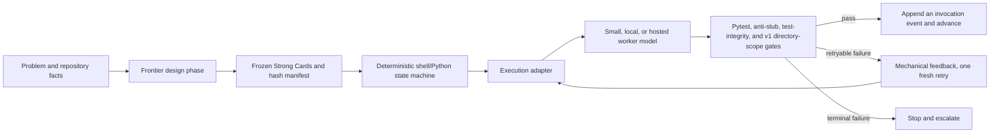

# Strong Cards

## A no-LLM-orchestrator pilot for model placement in software delivery

Local Gemma 4 31B made the published gates green through Card 9 on first
attempts. Local Qwen3.6 27B reached the same published-gate ceiling after an
extended retry. Eight hosted configurations reached it through OpenCode CLI
routes.

The important result is not that smaller models can imitate a frontier model.
It is that they can do substantial implementation work when frontier reasoning
is moved upstream and runtime authority is moved into deterministic code.

This repository contains the historical control scripts, frozen card artifacts,
derived result ledgers, two accepted Card 9 outputs, audits that found defects in
Cards 9 and 10, and the next protocol. It is a first pilot, not a universal
benchmark or a replay-complete release.

## The research question

Most model comparisons ask every model to solve the same open-ended prompt.
That mixes architecture, planning, implementation, tool use, taste, and
verification into one opaque score.

This experiment asked a different question:

> If a frontier model first compresses a problem into bounded, executable
> contracts, how much complex work can smaller and local models perform when a
> plain program, rather than another LLM, controls the run?

GPT-5.5 at medium reasoning effort, through Codex, authored the ten-card deck.
The manifest incorrectly labels authoring effort as high; session metadata and
the contemporary handoff recover the exact attribution. Deck development was
adaptive, and later cards incorporated prior failure evidence. All ten artifacts
were then hash-frozen before the principal comparison sweeps. The authoring model
left the runtime control plane.

At runtime, shell and Python code owned card order, dispatch, pytest, anti-stub
checks, one informed retry, stop conditions, and per-invocation evidence capture.
The worker LLM still chose code and tool actions; it made zero routing, retry,
acceptance, or stop decisions. The historical scripts are public, including
their incomplete v1 scope gate and directory-based—not OS-level—isolation.

## The result

### Local lane

| Model | Inference | Execution surface | Published-gate ceiling | Decisive observation |
|---|---|---|---:|---|
| `qwen3.6:27b-mtp-q8_0` | Ollama on the test machine | `claude-ollama` | C9 | C9 became 11/11 test-green on a 2,006 s informed rerun; a post-hoc multi-letter-cell probe failed |
| `gemma4:31b-coding-mtp-bf16` | Ollama on the test machine | `claude-ollama` | C9 | C1-C9 public gates passed on first attempts; C9 took 804 s |
| `qwen3.6:35b-a3b-mtp-q8_0` | Ollama on the test machine | `claude-ollama` | C8 | C9 exhausted both recorded timeboxes |

The machine was an Apple M5 Max MacBook Pro with an 18-core CPU and 128 GB of
unified memory. “Local” means inference occurred on that machine. It does not
mean free compute: hardware, energy, setup, and operator time are excluded.

The 2,006-second accepted Qwen C9 record exceeds the nominal 900-second retry
budget. The archive preserves the accepted result but not enough launch-level
telemetry to explain that overrun. It is reported as an anomaly, not normalized
away.

Post-hoc inspection also found that Qwen's C9 artifact cannot parse valid
multi-letter cells, while both local artifacts accept booleans and lose precision
on large integer division. The score is a published-gate result, not proof of the entire written
contract. [The accepted code and added probes are public.](evidence/card9-posthoc-audit.md)

### Hosted lane

Thirteen hosted configurations ran through the OpenCode CLI using OpenCode Go
model routes. Eight made the published gates green through C9: GLM-5.2,
MiMo-V2.5-Pro, Qwen3.7 Max, Qwen3.7 Plus, Qwen3.6 Plus, MiniMax M3, DeepSeek V4
Flash, and DeepSeek V4 Pro.

Kimi K2.7 Code had a C8 full-gate ceiling, or 8/9 comparative cards, although
its Card 9 tests were green twice; an over-broad anti-stub rule rejected a legitimate abstract
`NotImplementedError`. That is a gate defect, not clean evidence of a semantic
model failure.

The local and hosted lanes used different harnesses and time budgets, so this is
not a speed leaderboard. The defensible comparison is operational: both local
models made a multi-concept Card 9 gate green after receiving explicit algorithmic
guidance for parsing, dependency evaluation, rectangular ranges, and cycle
detection. This was guided implementation, not zero-shot problem solving.

[Open the card-by-card leaderboard](docs/leaderboard.md), then
[see the complete timings and attempt record](docs/results.md).

## Architecture: intelligence before the loop, authority outside the model



There is no LLM router, supervisor, or judge in the runtime control plane. The
controller is deliberately boring: a manifest, static arrays, shell loops,
adapters, gates, and an invocation-scoped JSONL file. The worker remains an LLM;
the claim is zero LLM control-plane decisions, not zero LLM decisions of any kind.

“Deterministic” does not mean the worker emits identical tokens. Inference stays
probabilistic. It means the control policy is explicit and replayable: given the
observed exit status and gate evidence, the next transition is fixed.

Viewed as a compiler architecture, frontier reasoning is the front end, Strong
Cards are a versioned intermediate representation, worker models are replaceable
back ends, and deterministic gates are the verifier. The experiment asks how
far capability can move down that pipeline once most unresolved architectural
judgment has already been compiled out of the execution cell.

[Inspect the historical runner](runner/README.md) and [read the hardened target
loop](protocol/minimal-loop.md).

## What a Strong Card changes

A Strong Card is not a longer prompt. It is a small execution contract:

- one goal and one writable implementation surface;
- an interface stub that fixes the shape of the answer;
- executable examples and property tests;
- explicit invariants and forbidden shortcuts;
- non-goals that prevent opportunistic widening;
- a failure protocol where stopping is valid behavior;
- an exact machine gate and completion record.

This moves effort left. The frontier model spends its reasoning budget once,
while ambiguity can still be removed. The worker is not asked to rediscover the
architecture on every card.

## Card 10 did not prove what it appeared to prove

The local models timed out or failed Card 10. GPT-5.5 xhigh, run through Codex as
an isolated reference, passed the seven published tests.

That looked like a clean frontier boundary. It was not.

The contract says `*` matches zero or more characters and explicitly excludes
filesystem path semantics. One test nevertheless requires `a*b` not to match
`a/b`. A second test contradicts the rule that a backslash escapes exactly one
following character. The reference solution hard-coded the slash pair and
broadened escaped-backslash behavior. A green gate therefore proved conformance
to contradictory tests, not a general glob-matching capability.

Card 10 is classified as invalid for comparative inference. It must be repaired,
given hidden and adversarial tests, frozen again, and rerun under one versioned
harness. Publishing that failure of measurement is part of the result: external
gates are only as trustworthy as the contracts they entail.

[Read the benchmark audit](evidence/card10-audit.md) and [inspect the exact GPT
reference artifact](evidence/reference-artifacts/gpt55-xhigh-c10/glob_matcher.py).

## Where smaller models belong

The experiment supports a specific division of labor:

| Pipeline region | Best owner | Why |
|---|---|---|
| Unresolved requirements and architecture | Frontier model with human authority | High ambiguity and expensive wrong turns |
| Contract and test construction | Frontier model, reviewed and frozen | Converts judgment into executable constraints |
| Bounded implementation cells | Smaller, local, or lower-cost worker | High volume, narrow decision surface, externally testable output |
| Dispatch, retry, acceptance, and stopping | Deterministic code | Policy should not drift with model output |
| Exceptions and contract defects | Human or frontier escalation | Requires new judgment, not more sampling |

Small models are useful here because they can absorb the high-volume middle of a
pipeline without receiving authority over the system. Local models add privacy,
offline availability, and zero marginal API billing where the hardware is
already owned. Hosted smaller models add elastic capacity. Neither should be
mistaken for an autonomous architect.

The practical rule is simple: route by decision entropy, not by task prestige.

[Use the placement guide.](docs/placement-guide.md)

For the precise protocol object, readiness test, and authority split, read
[The Strong Card concept](docs/strong-card-concept.md). For every headline claim,
its evidence class, replay path, and qualification, use the
[Proof index](PROOF-INDEX.md).

## What this pilot supports

It provides evidence that:

1. Local 27B and 31B models can make demanding implementation gates green when
   the prompt supplies a bounded contract and algorithmic guidance.
2. A deterministic controller can own the runtime decision path without an LLM
   orchestrator.
3. Harness quality is part of measured capability: earlier direct local routes
   produced no-write artifacts that disappeared under a functional tool loop.
4. Failure evidence can improve the system itself: the audit exposed an
   anti-stub false positive, a C9 coverage gap, and a contradictory final card.

It does not prove that small models can build arbitrary systems, that the card
method caused the observed performance, that a nine-card ceiling is a universal model ranking,
or that local execution is cheaper after total cost of ownership. There were no
replications, randomized trials, or common harness across the local and hosted
lanes.

## Repository map

- [Case study](CASE-STUDY.md): full research narrative and interpretation
- [Proof index](PROOF-INDEX.md): claim-to-artifact map, evidence classes, and audit order
- [Strong Card concept](docs/strong-card-concept.md): formal definition, required properties, lifecycle, and readiness test
- [Method](docs/method.md): design, controls, and threat model
- [Results](docs/results.md): complete model matrix and timings
- [Completion leaderboard](docs/leaderboard.md): every model across every progressive card
- [Limitations](docs/limitations.md): claim boundary and confounders
- [Next experiment](docs/next-experiment.md): repaired, repeated crossover design
- [Placement guide](docs/placement-guide.md): operational routing decisions
- [Frozen card artifacts](benchmark/README.md): contracts, initial stubs, and public tests
- [Evidence package](evidence/README.md): machine-readable derived records
- [Historical v1 runners](runner/README.md): de-identified control code and its limitations
- [Card 9 post-hoc audit](evidence/card9-posthoc-audit.md): accepted outputs and uncovered clauses
- [GPT Card 10 reference artifact](evidence/reference-artifacts/metadata.json): exact excluded implementation, gate output, and hashes
- [Strong Card template](protocol/strong-card-template.md): reusable contract
- [Controller policy](protocol/controller-policy.md): fixed transitions and stop rules
- [French LinkedIn post](docs/linkedin-post-fr.md): publication-ready version
- [English LinkedIn post](docs/linkedin-post-en.md): alternate version
- [Related work](REFERENCES.md): model routing and software-agent evaluation

## Verify the publication

The default verifier uses only the Python standard library:

```bash
make verify
```

It checks evidence consistency, model totals, card and runner hashes, accepted
artifact hashes and probes, required protocol sections, links, public-file
hygiene, every blob reachable from Git history, and commit metadata. The
published cards intentionally contain failing stubs; their tests
document the red starting state rather than a completed solution corpus.

After installing `requirements-dev.txt`, the optional red-gate check executes
all ten public suites and verifies that every frozen stub fails through pytest:

```bash
make verify-red
```

The same command also places the exact published GPT-5.5 xhigh Card 10 reference
beside the public normalized test and verifies that its excluded 7/7 gate result
replays. Property tests use the declared public replay seed `20260721`; this
stabilizes CI and is not presented as the unrecovered historical seed.

## Bottom line

This is not “a small model replaced the frontier model.”

The frontier model compressed ambiguity. Deterministic code held authority. The
smaller model performed the transformation.

That is not a model trick. It is a systems architecture.
